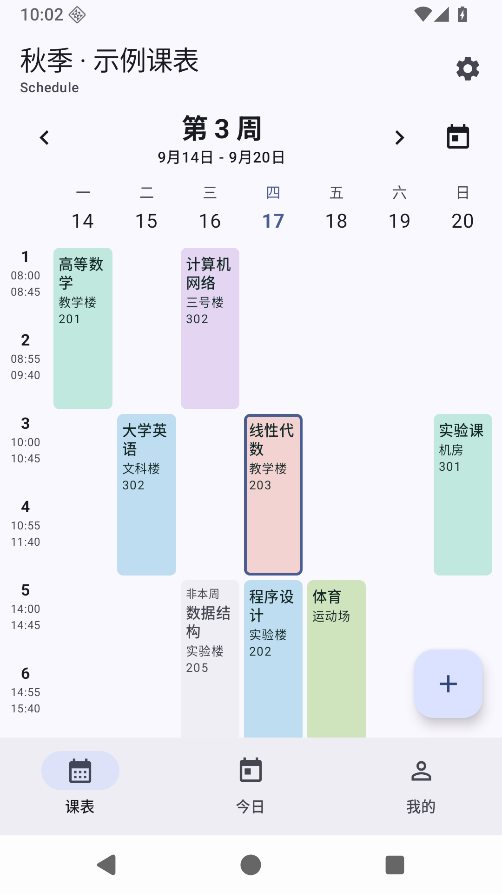
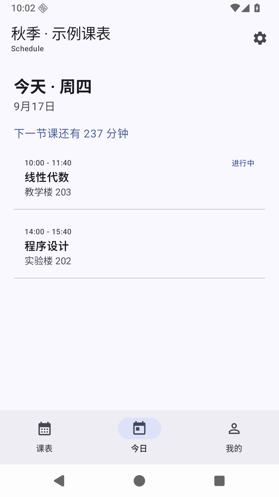
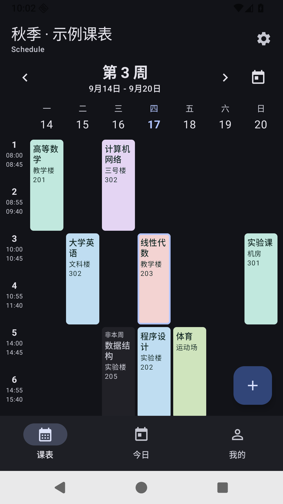

# Schedule

本地优先的 Android 课程表。Kotlin / Jetpack Compose / Material 3，最低 Android 8.0（API 26）。

## 下载安装

从 [GitHub Releases](https://github.com/Qi-huanye/Schedule/releases/latest) 下载 APK。
仅支持 Android 8.0 及以上。校验文件随安装包一起提供。

## 截图

以下为 Android 36 模拟器截图，课表内容为合成演示数据。

  

## 功能

- 多课表、独立开学日期、学期周数与作息时间。
- 周视图、滑动切周、回到本周、课程详情和多时段编辑。
- 单双周、周日、冲突课程分栏、当前课程突出显示。
- 今日课程、下一节课时间，系统/浅色/深色外观。
- ICS / JSON / 旧文本文件导入预览、导出和全课表原生备份。
- 可选课前提醒，今日课程和下一节课桌面组件。

## WakeUp 兼容情况

| 功能 | 当前证据与限制 |
|---|---|
| WakeUp JSON 导入 | 已通过外部字段格式、分行课程记录的合成样例测试；未验证所有官方版本 |
| WakeUp JSON 导出 | 已通过本项目解析往返测试；未在官方 App 验证 |
| WakeUp 旧分享文本导入 | 已验证前缀与 URL 编码 courseDetailJson 样例 |
| WakeUp 旧分享文本导出 | 已通过格式往返测试 |
| WakeUp 新版分享口令导入 | 实验性：主动开启公共兼容身份，内置 6.4.0 配置；直接访问官方接口。成功响应已完成解密、字段映射和事务入库测试 |
| WakeUp 新版分享口令生成 | 不支持，参考源码没有可靠的生成协议 |
| ICS 导入 | 支持带起止时间的单次、每周及隔周事件、UNTIL / COUNT、EXDATE / RDATE；已通过真机 SAF 文件导入验证 |
| ICS 导出 | 已验证单双周、跨年、转义与 UTF-8 行折叠 |
| 原生备份 | 版本化 JSON，保留全部课表与外观设置；恢复为新增课表 |

新版口令在“我的 -> 导入 / 导出 -> 分享口令”中使用。开启“实验兼容模式”后粘贴口令或完整分享文案，点击联网获取并确认预览。新安装默认关闭该模式，选择保存在本机；关闭时使用正常设备身份，不会静默切换。配置字段及协议限制见
[WAKEUP_PROTOCOL.md](docs/WAKEUP_PROTOCOL.md)。项目不包含官方 APK、真实设备 ID 或签名证书。内置的公开客户端协议参数可由导入配置覆盖，不包含用户凭据或会话令牌。

## 隐私

无账号、广告 SDK、统计 SDK、Firebase Analytics、用户追踪或自动更新请求。
数据保存到本机 Room 数据库，关闭 Android 云备份；原生备份由用户主动导出。
只有用户点击“联网获取课表”才向协议配置指定的 HTTPS 服务发出请求；该请求
普通模式包含派生设备标识、设备型号及必要协议字段；实验模式使用公开实现的全零兼容身份与固定设备参数，不读取本机 Android ID。不会读取电话、IMEI 或通讯录。
不记录分享内容、密钥或完整设备标识。普通导入导出使用 SAF，无全盘存储权限。

## 构建

JDK 17、Android SDK 36 / Build-Tools 36.0.0。Gradle Wrapper 固定为 8.13，
Android Gradle Plugin 8.10.1，Kotlin 2.1.20。配置 `ANDROID_HOME` 或本机 `local.properties`。

```sh
./gradlew test assembleDebug lintDebug
./gradlew connectedDebugAndroidTest
adb install -r app/build/outputs/apk/debug/app-debug.apk
```

常规设备测试不会联网。若要主动验证默认协议握手及设备拒绝响应：

```sh
./gradlew connectedDebugAndroidTest -Pandroid.testInstrumentationRunnerArguments.liveWakeUp=true
```

调试 APK 使用本机调试密钥。正式发布由 GitHub Actions 完成签名，密钥不进入仓库；配置与流程见 [发布维护](docs/RELEASING.md)。

本次生成的 APK 位于 `app/build/outputs/apk/debug/app-debug.apk`。
2026-09-17 已在 Android 36 模拟器安装运行；Debug / Release 各 80 项单元
测试通过；设备检查范围与外部兼容性限制见验证记录。构建、签名、需求核对及外部待验证项见
[验证记录](docs/VERIFICATION.md)。

## 架构

`domain` 是独立数据模型和日期/课程计算；`data/local` 为 Room；
`data/repository` 管理事务；`data/wakeup` 为 DTO、协议和密码学边界；
`ui` 使用 ViewModel/StateFlow；提醒与 Widget 共用领域计算。
详见 [ARCHITECTURE.md](docs/ARCHITECTURE.md) 和 [RESEARCH.md](docs/RESEARCH.md)。

## ICS 导入

在“我的 → 导入 / 导出 → 文件 / 文本 → 选择文件”选择 `.ics`，查看预览后确认导入。
最早上课日期所在周作为第 1 周；实际日期、重复课程及课程起止时间保留。
WakeUp 的节次说明用于恢复节次；ICS 未提供单节休息时长时，仅内部节次边界按比例估算。
暂不支持全天、跨午夜、月度重复及单次改期（RECURRENCE-ID）；不支持的内容会给出具体错误，不静默丢弃。

## 已知限制

- 实验口令模式依赖服务端当前接受的公共身份，未来可能失效；常规设备身份仍可能收到 410004。失败时可使用 ICS / JSON，不自动切换身份或调用第三方中转。
- WorkManager 提醒可能因 Doze、厂商省电或强行停止而延迟；不申请精确闹钟权限，不启用常驻前台服务。
- 桌面组件受系统周期更新限制，显示绝对上课时间，不承诺每分钟实时刷新。
- 当前数据库版本为 2，包含 v1 → v2 显式迁移，不启用破坏性迁移。
- 不支持不规则零节/负节课程和跨午夜作息，导入时明确拒绝，不静默丢弃。

## 开源许可证与参考

项目采用 Apache-2.0，见 [LICENSE](LICENSE)。WakeUp 协议算法移植自
[airline233/WakeUpDecoder](https://github.com/airline233/WakeUpDecoder)，
保留 [第三方声明](licenses/NOTICE) 和 [原许可证](licenses/decoder-LICENSE.txt)。

[lingion/sleepy](https://github.com/lingion/sleepy) 用于架构与格式研究；未直接复制 GPL 实现。
[Yngu196/Schedule](https://github.com/Yngu196/Schedule) 的直接源码访问返回 404，仅参考可访问 README 描述。

显示名称已改为 Schedule 0.2.0。为使覆盖安装保留现有数据，应用 ID、Room 数据库名及旧备份格式标识保持兼容。

### 每天节数与晚间课程

- 课表页点击右上角齿轮，可选择 8 / 10 / 12 / 14 节或自定义 1–30 节（不可少于已有课程占用的节次）。设置页按每天节数、学期信息、课表显示、作息时间分组。
- 添加课程时，点击上课时段卡片，在底部面板选择星期、开始节和结束节。开始节改变时尽量保留连续节数；结束节不会早于开始节。
- 如果导入课表只有 8 节，可直接在面板里把每天节数调到 10，再选第 9–10 节。新增作息与课程在同一事务保存，取消编辑不会修改数据库。
- 新增时间为建议值，请在课表设置中按学校实际作息调整。已有节次时间保持不变。

### 开学日期与前几周无课

课表设置顶部提供日历选择开学日期。修改日期时默认保持课程实际日期，自动换算周次；也可关闭开关保留原周次。通过「首课从第几周开始」整体平移全部课程，不必逐门编辑。预览会显示无课周和课程周次范围，单双周随偏移正确转换，必要时扩展学期周数；不允许将课程移出第 1–60 周。

### 主界面周视图

主界面仅保留齿轮设置入口，不绘制底层网格。滑动周课表使用分页动画和吸附，箭头与回到本周按钮同样平滑翻页。查看非当前周时标题标注「非本周」。当前查看周的课程正常显示；其他周的课程仅在完整空课位淡显并标注「非本周」，优先选择距离查看周最近的安排，避免导入的重复周次堆叠。

### 固定课时与课程配色

课表设置 → 作息时间可开启「固定每节课时长」，输入 1–240 分钟；所有结束时间按开始时间自动计算，结束时间变为只读。关闭后可手动编辑。修改时长会重算全部结束时间，跨天或重叠无法保存。

课表设置 → 课程配色提供柔和缤纷、森林薄荷、晴空蓝紫、暖日桃橙四套方案及预览。切换方案并保存时更新当前课表全部课程的颜色，新课程沿用该方案；单门课程仍可单独选色，再次保存同一方案不会覆盖单独修改。「保留现有颜色」不会重染色块。设置按课表保存，并随 JSON 备份还原。数据库从 v1 无损升级至 v2。
