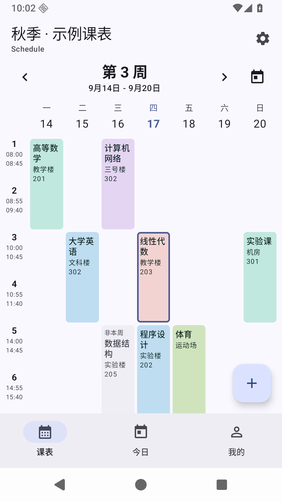
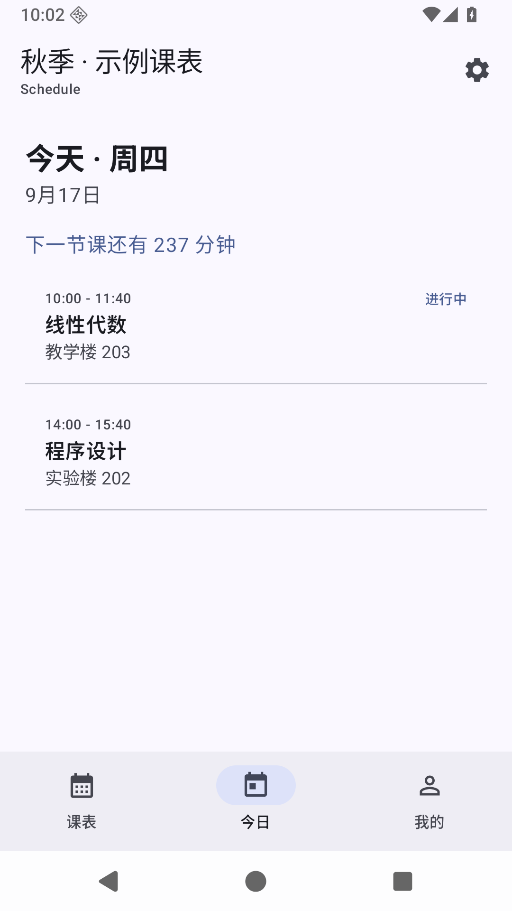
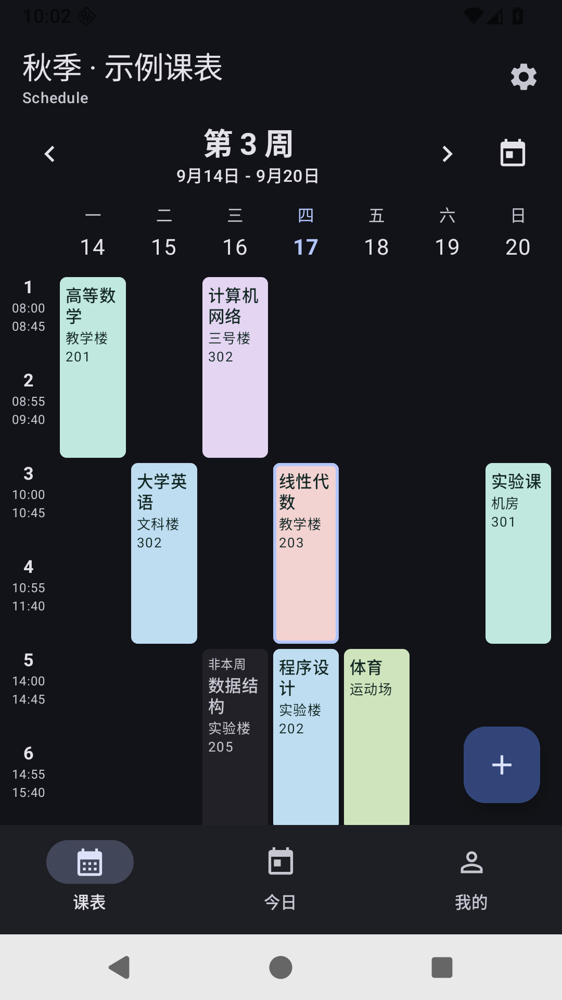

# Schedule

本地优先的 Android 课程表。Kotlin / Jetpack Compose / Material 3，最低 Android 8.0（API 26）。

## 下载安装

从 [GitHub Releases](https://github.com/Qi-huanye/Schedule/releases/latest) 下载 APK。
仅支持 Android 8.0 及以上。校验文件随安装包一起提供。

## 截图

以下为 Android 36 模拟器截图，课表内容为合成演示数据。

  

## 功能

- 多课表、独立开学日期、学期周数与作息时间。
- 周视图、滑动切周、回到本周、课程详情和多时段编辑。
- 单双周、周日、冲突课程分栏、当前课程突出显示。
- 今日课程、下一节课时间，系统/浅色/深色外观。
- 自选应用背景，Celebi 取色生成浅色/深色主题；可独立开启课程跟随背景配色。
- ICS / JSON / 旧文本文件导入预览、导出和全课表原生备份。
- 可选课前提醒，今日课程和下一节课桌面组件。
- 自动检查 GitHub 正式版更新（每天最多一次），应用内下载并校验后交给系统安装；支持手动检查、跳过某个版本及关闭自动检查。

## WakeUp 兼容情况

| 功能 | 当前证据与限制 |
|---|---|
| WakeUp JSON 导入 | 已通过外部字段格式、分行课程记录的合成样例测试；未验证所有官方版本 |
| WakeUp JSON 导出 | 已通过本项目解析往返测试；未在官方 App 验证 |
| WakeUp 旧分享文本导入 | 已验证前缀与 URL 编码 courseDetailJson 样例 |
| WakeUp 旧分享文本导出 | 已通过格式往返测试 |
| WakeUp 新版分享口令导入 | 实验性：主动开启公共兼容身份，内置 6.4.0 配置；直接访问官方接口。成功响应已完成解密、字段映射和事务入库测试 |
| WakeUp 新版分享口令生成 | 不支持，参考源码没有可靠的生成协议 |
| ICS 导入 | 支持带起止时间的单次、每周及隔周事件、UNTIL / COUNT、EXDATE / RDATE；已通过真机 SAF 文件导入验证 |
| ICS 导出 | 已验证单双周、跨年、转义与 UTF-8 行折叠 |
| 原生备份 | 版本化 JSON，保留全部课表与课表外观设置；恢复为新增课表；不包含本机背景图片与背景配色开关 |

新版口令在“我的 → 导入与导出 → WakeUp 分享口令”中使用。开启“实验兼容模式”后粘贴口令或完整分享文案，点击联网获取并确认预览。新安装默认关闭该模式，选择保存在本机；关闭时使用正常设备身份，不会静默切换。配置字段及协议限制见
[WAKEUP_PROTOCOL.md](docs/WAKEUP_PROTOCOL.md)。项目不包含官方 APK、真实设备 ID 或签名证书。内置的公开客户端协议参数可由导入配置覆盖，不包含用户凭据或会话令牌。

## 隐私

无账号、广告 SDK、统计 SDK、Firebase Analytics 或用户追踪。
数据保存到本机 Room 数据库，关闭 Android 云备份；原生备份由用户主动导出。
默认在打开应用时检查 GitHub 正式版更新，每 24 小时最多自动请求一次（失败也计入）。可在“我的”关闭自动检查，或手动点击“检查更新”。检查仅向 GitHub 请求公开发布信息，不携带课表或设备标识；GitHub 可见普通网络请求的来源 IP 与应用版本。发现新版时可选择“稍后”或“跳过此版本”，手动检查仍可查看已跳过的版本。点击“更新”后在应用内从同一 GitHub 发布下载 APK，核对发布中 `SHA256SUMS.txt` 的 SHA-256、包名、版本与签名，再交给系统安装程序由用户确认；首次需在系统设置中允许 Schedule 安装应用（`REQUEST_INSTALL_PACKAGES`）。安装包只保存在应用缓存，下次启动时清理。下载或校验失败时可改用浏览器下载。
用户点击“联网获取课表”时向协议配置指定的 HTTPS 服务发出请求；该请求
普通模式包含派生设备标识、设备型号及必要协议字段；实验模式使用公开实现的全零兼容身份与固定设备参数，不读取本机 Android ID。不会读取电话、IMEI 或通讯录。
不记录分享内容、密钥或完整设备标识。普通导入导出使用 SAF，无全盘存储权限。
背景通过系统图片选择器导入，在本机缩放、校正方向并移除原始元数据后保存到应用私有目录；取色不联网，不上传图片。

## 构建

JDK 17、Android SDK 36 / Build-Tools 36.0.0。Gradle Wrapper 固定为 8.13，
Android Gradle Plugin 8.10.1，Kotlin 2.1.20。配置 `ANDROID_HOME` 或本机 `local.properties`。

```sh
./gradlew test assembleDebug lintDebug
./gradlew connectedDebugAndroidTest
adb install -r app/build/outputs/apk/debug/app-debug.apk
```

常规设备测试不会联网。若要主动验证默认协议握手及设备拒绝响应：

```sh
./gradlew connectedDebugAndroidTest -Pandroid.testInstrumentationRunnerArguments.liveWakeUp=true
```

调试 APK 使用本机调试密钥。正式发布由 GitHub Actions 完成签名，密钥不进入仓库；配置与流程见 [发布维护](docs/RELEASING.md)。

本次生成的 APK 位于 `app/build/outputs/apk/debug/app-debug.apk`。
0.3.0 已在 Android 36 模拟器与 HarmonyOS 4.2 真机安装运行；Debug / Release 各 140 项单元
测试通过；设备检查范围与外部兼容性限制见验证记录。构建、签名、需求核对及外部待验证项见
[验证记录](docs/VERIFICATION.md)。

## 架构

`domain` 是独立数据模型和日期/课程计算；`data/local` 为 Room；
`data/repository` 管理事务；`data/wakeup` 为 DTO、协议和密码学边界；
`ui` 使用 ViewModel/StateFlow；提醒与 Widget 共用领域计算。
详见 [ARCHITECTURE.md](docs/ARCHITECTURE.md) 和 [RESEARCH.md](docs/RESEARCH.md)。

## ICS 导入

在“我的 → 导入与导出 → 选择文件”选择 `.ics`，在确认框中导入。
最早上课日期所在周作为第 1 周；实际日期、重复课程及课程起止时间保留。
WakeUp 的节次说明用于恢复节次；ICS 未提供单节休息时长时，仅内部节次边界按比例估算。
暂不支持全天、跨午夜、月度重复及单次改期（RECURRENCE-ID）；不支持的内容会给出具体错误，不静默丢弃。

## 已知限制

- 实验口令模式依赖服务端当前接受的公共身份，未来可能失效；常规设备身份仍可能收到 410004。失败时可使用 ICS / JSON，不自动切换身份或调用第三方中转。
- WorkManager 提醒可能因 Doze、厂商省电或强行停止而延迟；不申请精确闹钟权限，不启用常驻前台服务。
- 桌面组件受系统周期更新限制，显示绝对上课时间，不承诺每分钟实时刷新。
- 当前数据库版本为 2，包含 v1 → v2 显式迁移，不启用破坏性迁移。
- 不支持不规则零节/负节课程和跨午夜作息，导入时明确拒绝，不静默丢弃。

## 开源许可证与参考

项目采用 Apache-2.0，见 [LICENSE](LICENSE)。WakeUp 协议算法移植自
[airline233/WakeUpDecoder](https://github.com/airline233/WakeUpDecoder)，
保留 [第三方声明](licenses/NOTICE) 和 [原许可证](licenses/decoder-LICENSE.txt)。

[lingion/sleepy](https://github.com/lingion/sleepy) 用于架构与格式研究；未直接复制 GPL 实现。
[MaterialKolor](https://github.com/jordond/MaterialKolor) 提供 Kotlin 版
[Material Color Utilities](https://github.com/material-foundation/material-color-utilities)；背景使用 Celebi / Score 取色和 HCT Tonal Spot 配色。Kotlin 移植采用 MIT 许可证，上游算法采用 Apache-2.0，声明见 `licenses/`。
[Yngu196/Schedule](https://github.com/Yngu196/Schedule) 的直接源码访问返回 404，仅参考可访问 README 描述。

显示名称已改为 Schedule 0.2.0。为使覆盖安装保留现有数据，应用 ID、Room 数据库名及旧备份格式标识保持兼容。

### 每天节数与晚间课程

- 「我的 → 作息时间」用步进器调整每天 1–30 节（不可少于已有课程占用的节次），点时间即可修改。
- 添加课程时点上课时间，在面板中点选星期；节次和周次网格先点起点、再点终点，单双周直接显示在周次网格上。
- 如果导入课表只有 8 节，可点节次网格末尾的「+」增加一节，再选第 9–10 节。新增作息与课程在同一事务保存，取消编辑不会修改数据库。
- 新增时间为建议值，请在「我的 → 作息时间」按学校实际作息调整。已有节次时间保持不变。

### 开学日期与前几周无课

「我的 → 学期」选择开学日期。修改日期后选择「课程日期不变」（自动换算周次）或「周次不变」。「第一节课在」整体平移全部课程，不必逐门编辑；下方周次条预览有课的周，单双周随偏移正确转换，必要时扩展学期周数；不允许将课程移出第 1–60 周。

### 主界面周视图

顶栏显示周次和课表名，点击可跳到任意周，或切换、新建、导入课表；设置统一在「我的」。滑动周课表使用分页动画和吸附，箭头与回到本周按钮同样平滑翻页。查看非当前周时标题标注「非本周」。当前查看周的课程正常显示；其他周的课程仅在完整空课位淡显并标注「非本周」，优先选择距离查看周最近的安排，避免导入的重复周次堆叠。

### 固定课时与课程配色

「我的 → 作息时间」可开启「固定课时」，以 5 分钟为步长设置时长（最长 240 分钟）；所有结束时间按开始时间自动计算，结束时间变为只读。关闭后可手动编辑。修改时长会重算全部结束时间，跨天或重叠无法保存。

「我的 → 课程配色」提供柔和缤纷、森林薄荷、晴空蓝紫、暖日桃橙四套方案及预览。切换方案并保存时更新当前课表全部课程的颜色，新课程沿用该方案；单门课程仍可单独选色，再次保存同一方案不会覆盖单独修改。「保留现有颜色」不会重染色块。设置按课表保存，并随 JSON 备份还原。数据库从 v1 无损升级至 v2。

### 自定义背景与图片主题

在「我的 → 外观 → 背景图片」选择图片，可更换或移除；设置后才显示模糊、位置和「主题跟随背景」。支持系统能解码的图片，输入最大 32 MiB，保存时最长边不超过 2048 像素。图片导入后保存在应用私有目录，删除相册中的原图不会影响背景。

「主题跟随背景」默认开启，自动生成全应用的浅色与深色主题，继续遵循系统/浅色/深色选项；关闭后恢复原有主题，背景图片仍保留。「课程配色 → 跟随背景」默认不选，选中后课表与今日课程使用六种自动生成的颜色；只改变显示，不改写已保存的课程颜色，关闭即可恢复。文字、表单与对话框有独立底色以保持可读性。

背景图片与这两个开关属于本机设置，不包含在课表 JSON 备份中。导入失败保留原背景；移除背景后恢复原有主题与课程显示。
